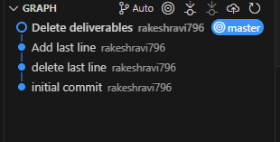
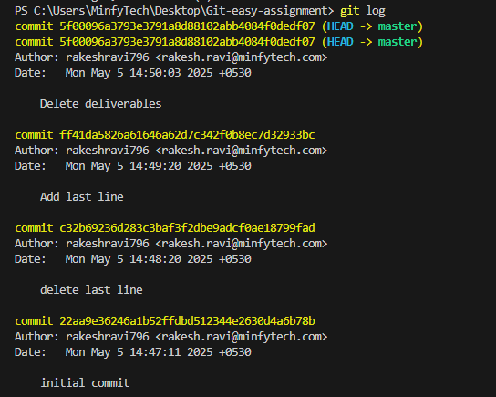

<h1>Assignment 1: Basic Git Workflow</h1> 

<h3>The git repository and it's commit history graph</h3>

<h3>Screenshot of the git log output</h3>

<h3> Explanation of the commits </h3>

<ul>
    <li><b>Initial Commit</b> : Created a text file called sample.txt and contained the reqiremnts and deliverables for assignment 1</li>
    <li><b>delete last line</b> : Deleted the last line in the text file</li>
    <li><b>Add last line </b>: Added a last line for the text file</li>
    <li><b>Deleted deliverables</b> : Deleted the deliverables part in the text file</li>

</ul>